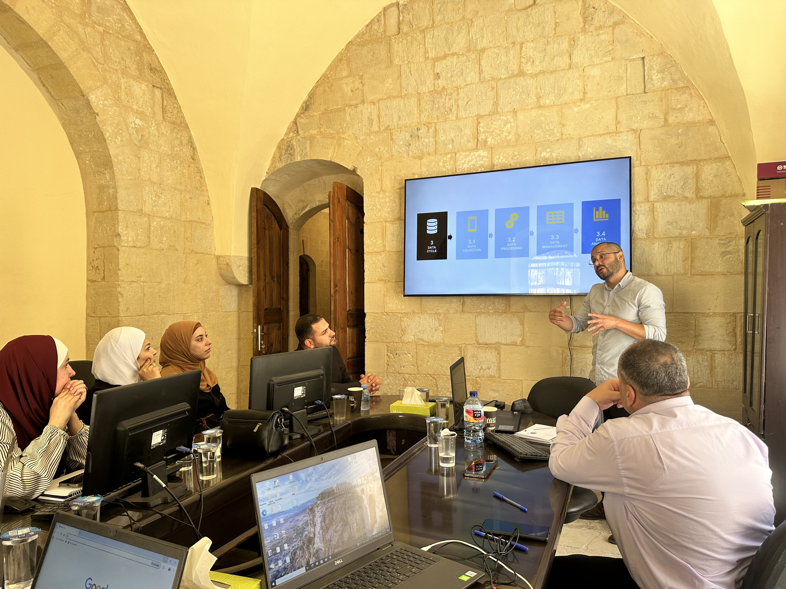

---
hide:
  - toc
  - navigation
---
<!--
CHECKLIST FOR THIS PAGE:
- [x] Replace [YOUR NAME] with your full name (3 places)
- [ ] Replace [YOUR JOB TITLE] with your current or target role
- [ ] Replace [YOUR TAGLINE] with a short phrase describing your focus
- [ ] Rewrite the About Me paragraph with your own words
- [x] Replace assets/images/profile.png with your actual photo (keep the filename or update it below)
- [x] Replace assets/images/about.png with your own image (a field photo, map, or workspace shot)
- [ ] Edit the skill cards to match your actual skills (add, remove, or rename cards as needed)
- [x] Update GitHub and LinkedIn links in the Connect section
- [x] Add your CV PDF to docs/assets/ and update the filename in the Download CV button
-->

  
  

    <h1>Mario Tavera</h1>
    <h2>Geospatial Data Specialist</h2>
    
Geographer and Urban Planner specialized in spatial data analytics, automated Python GIS workflows, and remote sensing processing for data-driven decision making.

  

---

### About Me

Coming from the human and social sciences, I have always been driven by a desire to understand and communicate complex spatial phenomena. Over the past 9+ years, working with multidisciplinary teams and meeting  amazing people, that baseline has evolved through intense technical dedication—continuously learning, adapting, and mastering spatial data analytics to bridge the gap between human environments and hard data.

Today, as a Geospatial Data Specialist with extensive experience at international organizations, I combine that analytical vision with automated Python GIS workflows, Database design and management, Earth Observation, and interactive visualization. I specialize in navigating data-scarce environments, turning fragmented spatial information into reproducible pipelines and actionable intelligence for decision-makers.

Whether engineering automated ETL workflows, modeling urban climate resilience, or facilitating technical capacity-building workshops for multidisciplinary teams, my focus remains the same: leveraging continuous technical innovation to solve real-world spatial challenges.

  

---

[View My Projects :material-arrow-right:](projects/index.md){ .md-button .md-button--primary }
[Download CV :material-download:](assets/mariotavera-CV.pdf){ .md-button }

---
## Skills

  <!-- Card 1 -->
  

    <h4 style="margin: 0 0 0.6rem 0; font-size: 0.88rem; font-weight: 700; color: #1e293b; border-bottom: 1px solid #cbd5e1; padding-bottom: 0.4rem; white-space: nowrap; overflow: hidden; text-overflow: ellipsis;">
      🛠️ GIS & Remote Sensing
    </h4>
    <ul style="margin: 0; padding-left: 1.1rem; font-size: 0.82rem; color: #334155; line-height: 1.5;">
      <li>QGIS, ArcGIS Pro, Google Earth Engine</li>
      <li>Field Data Collection (ODK, Kobo, Mobile GIS)</li>
      <li>GDAL / OGR, WhiteboxTools</li>
      <li>Multispectral & SAR Image Analysis</li>
      <li>Data Standardization in Crisis Contexts</li>
    </ul>
  

  <!-- Card 2 -->
  

    <h4 style="margin: 0 0 0.6rem 0; font-size: 0.88rem; font-weight: 700; color: #1e293b; border-bottom: 1px solid #cbd5e1; padding-bottom: 0.4rem;">
      🗄️ Data Architecture & Web Apps
    </h4>
    <ul style="margin: 0; padding-left: 1.1rem; font-size: 0.82rem; color: #334155; line-height: 1.5;">
      <li>Multi-User PostGIS Schema & Governance</li>
      <li>Geodatabase Modeling & Data Lifecycles</li>
      <li>Power BI Executive Reporting & Dashboards</li>
      <li>Interactive Web Mapping (Leaflet, Streamlit)</li>
    </ul>
  

  <!-- Card 3 -->
  

    <h4 style="margin: 0 0 0.6rem 0; font-size: 0.88rem; font-weight: 700; color: #1e293b; border-bottom: 1px solid #cbd5e1; padding-bottom: 0.4rem;">
      💻 Programming & Pipelines
    </h4>
    <ul style="margin: 0; padding-left: 1.1rem; font-size: 0.82rem; color: #334155; line-height: 1.5;">
      <li>Python — GeoPandas, Shapely, Rasterio</li>
      <li>Advanced SQL, PostgreSQL + PostGIS</li>
      <li>Automated Spatial ETL & Reproducible Pipelines</li>
      <li>JavaScript — Leaflet.js, MapLibre GL</li>
    </ul>
  

  <!-- Card 4 -->
  

    <h4 style="margin: 0 0 0.6rem 0; font-size: 0.88rem; font-weight: 700; color: #1e293b; border-bottom: 1px solid #cbd5e1; padding-bottom: 0.4rem;">
      📐 Spatial Analytics & Modeling
    </h4>
    <ul style="margin: 0; padding-left: 1.1rem; font-size: 0.82rem; color: #334155; line-height: 1.5;">
      <li>Network Accessibility & Climate Vulnerability</li>
      <li>Proxy Indicator Modeling for SDGs (Data-Scarce)</li>
      <li>Automated Investment Scoring & Multi-Criteria Evaluation Models</li>
      <li>Spatial Statistics & Pattern Analysis</li>
    </ul>
  

  <!-- Card 5 -->
  

    <h4 style="margin: 0 0 0.6rem 0; font-size: 0.88rem; font-weight: 700; color: #1e293b; border-bottom: 1px solid #cbd5e1; padding-bottom: 0.4rem;">
      📋 Project Management & Monitoring
    </h4>
    <ul style="margin: 0; padding-left: 1.1rem; font-size: 0.82rem; color: #334155; line-height: 1.5;">
      <li>Technical-Institutional Liaison & Leadership</li>
      <li>Data Governance & Quality Assurance (QA/QC) Systematization</li>
      <li>Methodological SOPs & Technical Documentation</li>
      <li>Lessons Learned Frameworks & Asset Transfer</li>
    </ul>
  

  <!-- Card 6 -->
  

    <h4 style="margin: 0 0 0.6rem 0; font-size: 0.88rem; font-weight: 700; color: #1e293b; border-bottom: 1px solid #cbd5e1; padding-bottom: 0.4rem;">
      🏛️ Capacity Building & Strategy
    </h4>
    <ul style="margin: 0; padding-left: 1.1rem; font-size: 0.82rem; color: #334155; line-height: 1.5;">
      <li>"Data-to-Plan" Methodological Frameworks</li>
      <li>Digital Maturity & Needs Assessments</li>
      <li>Multiscalar Training Programs & Capacity Building</li>
      <li>Institutional Digital Transformation for Public Sector</li>
      <li>Multi-Level Stakeholder Alignment</li>
    </ul>
  

---

## Connect

[GitHub](https://github.com/Mariotavera){ .md-button }
[LinkedIn](https://linkedin.com/in/mario-tavera-palomino){ .md-button }
