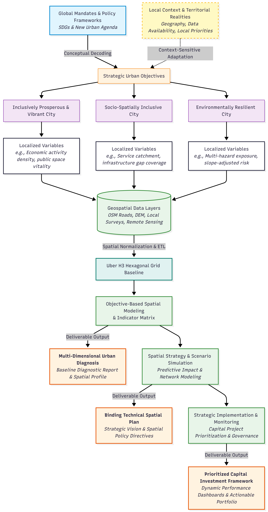

<!--
CHECKLIST FOR THIS PAGE (copy this file for each new project):
- [ ] Replace [YOUR PROJECT TITLE] with your project title
- [ ] Replace the hero image with your own (add to docs/assets/images/)
- [ ] Update the Overview section
- [ ] Update the Methods & Tools section
- [ ] Update the Key Findings section
- [ ] Update the Links section
- [ ] Add a card for this project on docs/projects/index.md
- [ ] Add a nav entry in mkdocs.yml
-->

{ style="width:100%; max-height:250px; object-fit:cover; border-radius:8px;" }

# Multi-Dimensional Urban Diagnosis & Strategic Planning
## Overview & Institutional Context

The **UN-Habitat Headquarters Urban Lab** operates as an agile, international task force dedicated to translating high-level global mandates—such as the **New Urban Agenda** and **Sustainable Development Goals (SDGs)**—into actionable, site-specific territorial strategies. Operating at the intersection of **spatial science, urban design, and public policy**, the Urban Lab deploys innovative and participatory frameworks to address rapid urbanization, climate vulnerability, forced migration, conflict, and deep socio-spatial inequality across diverse international contexts.

In an era of compounding global crises, local governments frequently face the challenge of making urgent, high-stakes spatial investments in **data-scarce and structurally vulnerable environments**. To bridge this gap, the Urban Lab drives **evidence-based decision-making** by anchoring territorial planning in rigorous spatial analytics.

As a **Spatial Data Analyst** within this framework, my role focused on building the underlying **data architecture**, **advanced proxy models**, and **analytical pipelines** required to transform heterogeneous spatial information into **binding policy documents**, **strategic urban plans**, and **prioritized capital investment frameworks**.

  

---

## Spatial Data in Evidence-Based Urban Planning Process

To operationalize global mandates into local realities, spatial data science must be **embedded directly into every stage of the planning cycle**. Rather than treating data collection as an isolated preliminary task, the framework aligns technical workflows with policy goals. Abstract institutional concepts—such as the ones promoted by **New Urban Agenda** —are systematically decoded and deconstructed into **measurable spatial variables** to assess city perfomance.

Crucially, this decoding process is **context-sensitive and localized**. Global pillars are adapted to the unique geographical, environmental, and socio-economic realities of each territory through **participatory validation**, ensuring that the resulting spatial data layers accurately reflect local priorities and data availability before **normalization into analytical grids**.

In contexts characterized by data scarcity or rapid territorial transformation, traditional diagnostic methods often lack the agility required for timely intervention. By combining **open-source spatial technologies**, **remote sensing**, **participatory data validation**, and creative analytical problem-solving, this process establishes a **rapid, highly scalable planning pipeline** that equips local governments with **actionable intelligence** without delaying critical decisions.

=== "1. Planning & Data Framework"

    <table style="width: 100%; border-collapse: collapse; margin-top: 1em; margin-bottom: 1em;">
      <thead>
        <tr style="border-bottom: 2px solid #ccc; text-align: left;">
          <th style="padding: 10px; width: 25%;">Planning Phase</th>
          <th style="padding: 10px; width: 37.5%;">Strategic Planning Approach</th>
          <th style="padding: 10px; width: 37.5%;">Data Integration & Analytics Workflow</th>
        </tr>
      </thead>
      <tbody>
        <tr style="border-bottom: 1px solid #eee;">
          <td style="padding: 10px; vertical-align: top;"><strong>Phase 1: Multi-Dimensional Urban Diagnosis</strong></td>
          <td style="padding: 10px; vertical-align: top;">
            <strong>Rapid & Participatory Territorial Assessment</strong> 
            Executes an agile evaluation of spatial dynamics, infrastructural gaps, socio-spatial inequalities, and climate hazards. Leverages open-source geospatial tools and community-driven knowledge to build a robust baseline in data-scarce environments.
          </td>
          <td style="padding: 10px; vertical-align: top;">
            <strong>ETL & Conceptual Spatial Modeling</strong> 
            Integrates heterogeneous data sources (official records, field surveys, spatial proxies, remote sensing) validated through community participation. Disparate layers are normalized into <strong>Uber H3</strong> hexagonal grids, enabling proxy-based modeling to decode complex socio-environmental concepts into quantifiable variables.
          </td>
        </tr>
        <tr style="border-bottom: 1px solid #eee;">
          <td style="padding: 10px; vertical-align: top;"><strong>Phase 2: Strategic Urban Planning & Scenario Simulation</strong></td>
          <td style="padding: 10px; vertical-align: top;">
            <strong>Policy Formulation & Spatial Prioritization</strong> 
            Translates diagnostic findings into long-term strategic visions, urban policies, and targeted intervention frameworks (e.g., priority investment zones, strategic development hubs, and mobility corridors).
          </td>
          <td style="padding: 10px; vertical-align: top;">
            <strong>Predictive Scenario Modeling</strong> 
            Simulates the spatial behavior and impact of proposed interventions. Evaluates how spatial policy choices alter territorial connectivity, network accessibility, and multi-hazard exposure prior to capital allocation.
          </td>
        </tr>
        <tr>
          <td style="padding: 10px; vertical-align: top;"><strong>Phase 3: Strategic Implementation & Continuous Monitoring</strong></td>
          <td style="padding: 10px; vertical-align: top;">
            <strong>Capital Project Operationalization & Governance</strong> 
            Converts strategic spatial plans into phased, capital-budgeted municipal projects, actionable policy guidelines, and long-term data governance mechanisms.
          </td>
          <td style="padding: 10px; vertical-align: top;">
            <strong>Grid-Level Performance Tracking</strong> 
            Establishes structured geospatial databases and cell-level baseline metrics within the <strong>Uber H3</strong> grid to track performance over time. Automated spatial pipelines feed enable ongoing indicator evaluation to support for local authorities.
          </td>
        </tr>
      </tbody>
    </table>

=== "2. Data Workflow"

    

    { width="70%" }

    

=== "3. Decoding Exercise"

    

    { width="70%" }

    

=== "4. Spatial Modeling & Indicators"

    

    { width="70%" }

    

> **Data Disclaimer:** *Map displays and metric visualisations have been anonymised or recreated using open synthetic baseline data to protect institutional IP, demonstrating the technical pipeline without disclosing proprietary UN-Habitat datasets.*
{: style="font-size: 0.85em; color: #666;" }

---
## Methodological Leadership, Strategic Planning & Digital Transformation

Beyond building spatial data architectures and generating territorial insights, my role focused on ensuring diagnostics led to binding institutional policy rather than remaining static technical outputs. To achieve this, I contributed to bridging high-level urban governance, multi-stakeholder coordination, and digital process optimization across every stage of the planning cycle.

* **Strategic Advisory & Executive Authoring:** Co-authored binding diagnostic reports and policy briefs. Visualized complex spatial proxy models into actionable directives for mayors, ministers, and non-technical decision-makers.
* **Spatial Digital Transformation:** Modernized legacy, fragmented planning workflows into open-source, reproducible spatial pipelines (Uber H3, Python, PostGIS), driving digital adoption across municipal units.
* **Knowledge Management & Capacity Building:** Systematized end-to-end diagnostic methodologies into standardized technical repositories and training modules, enabling local authorities and international teams to replicate frameworks independently.

  

Methodological alignment session and spatial framework presentation with international technical teams and stakeholders.
{: style="font-size: 0.85em; color: #666; text-align: center; margin-top: -1em; margin-bottom: 1.5em;" }

  <a href="../" class="md-button md-button--primary" style="margin-right: 10px;">← Back to Projects</a>

---

## Links

[View Code on GitHub](https://github.com/[YOUR-GITHUB-USERNAME]/[YOUR-REPO-NAME]){ .md-button }
[View Data Source](https://example.com){ .md-button }
